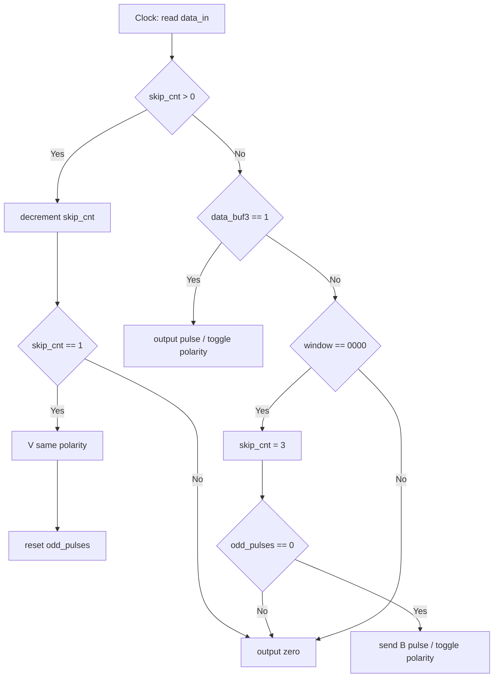
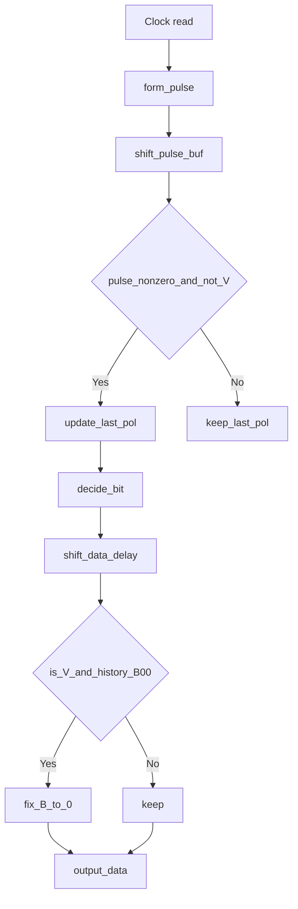

# HDB3 编码/译码 教学项目（面向零基础用户）

---

## 项目结构（文件与作用）

- `sources_1/new/gen_data.v` - LFSR 伪随机数据发生器（用于简单随机测试）。
- `sources_1/new/gen_data_fixed.v` - 固定测试序列（包含连续 0，用来触发 HDB3 替代规则）。推荐初学者先用这个。
- `sources_1/new/hdb3_enc.v` - HDB3 编码器（把 1/0 变成双极性脉冲信号 hdb3_p/hdb3_n）。
- `sources_1/new/hdb3_dec.v` - HDB3 译码器（从双极性脉冲还原 1/0，带修正机制）。
- `sources_1/new/hdb3_top.v` - 顶层模块（把生成器、编码器、译码器连在一起）。
- `sim_1/new/tb_hdb3.v` - 仿真测试平台（产时钟、复位，运行仿真）。
- `constrs_1/new/hdb3.xdc` - 时钟约束文件（包含 50MHz 时钟约束，IO 引脚暂未绑定）。

---

## HDB3 原理

1. HDB3 是一种把二进制数据（1 和 0）转换成“正脉冲 / 负脉冲 / 无脉冲”（双极性）的方法。它的目标是：避免长时间同极性导致直流分量，并保证接收端可以恢复时钟。

2. 基本规则（用极其简单的话）：

   - 每个数据 1 用一个脉冲表示，脉冲极性交替（+、-、+、-……）。
   - 如果遇到 4 个连续的 0（`0000`），不能直接发送 4 个空位，会用特殊替代来打破直流：
     - 若自上次 V（破坏脉冲）以来已发送的脉冲个数是偶数（parity = 偶），用 `B00V`：在第 3 位发送一个正常脉冲（B），第 4 位发送 V（V 的极性与上一个脉冲相同）。
     - 若脉冲个数是奇数，用 `000V`：在第 4 位只发送一个 V（V 的极性与上一个脉冲相同）。
   - B 是“伪装成 1 的脉冲”，V 是“破坏脉冲”（用来修正直流）。

3. 两点记住：
   - `V` 与上一次有效脉冲同极性（故能改变串行极性平衡）；
   - 接收端需要能识别 V，并把先前的 B（如果存在）修正回 0，从而恢复原始的 `0000`。

---

## 本项目如何实现 HDB3

- 编码器（`hdb3_enc.v`）：

  1. 用 4 位滑动窗口观察是否出现 `0000`。窗口最新移入位保存在 `data_buf`。
  2. 跟踪上一次脉冲极性 `last_pulse_pol`（0 表示负，1 表示正）。
  3. 用 `odd_pulses` 标志记录自上次 V 以来脉冲的奇偶性（0 偶数，1 奇数）。
  4. 遇到 `0000`：
     - 如果 `odd_pulses == 0`（偶数），输出 `B00V`（先输出 B，然后中间为 0，最后输出 V）。
     - 若 `odd_pulses == 1`（奇数），输出 `000V`（前三位保持 0，第四位输出 V）。
  5. 对于普通的 1：输出一个脉冲并翻转 `last_pulse_pol` 和 `odd_pulses`。

- 译码器（`hdb3_dec.v`）：
  1. 读取两路信号 `hdb3_p`（正脉冲）、`hdb3_n`（负脉冲），把它们合成 2-bit `current_pulse`：`01`=正，`11`=负，`00`=空。
  2. 维护一个 `pulse_buf` 的循环历史（最近 4 个周期），用于检测 `B00V` 模式（回溯检测）。
  3. 通过比较当前脉冲极性与 `last_pulse_pol` 来判断当前脉冲是否为 V（如果相同则认为是 V）。
  4. 当检测到 V 且历史为 `B,0,0` 时，把历史中的 B 修正为 0，从而把 `B00V` 恢复成 `0000`。
  5. 输出的位会有一定延迟（因为译码器需要历史信息来做修正）。

---

## 如何在 Vivado 中仿真

1. 把所有源文件添加到 Vivado 工程（Design Sources / Simulation Sources）。
2. 打开 `tb_hdb3.v`，在仿真中运行 “Behavioral Simulation”。
3. 在波形窗口添加信号：`data_orig`, `hdb3_p`, `hdb3_n`, `data_decoded`。
4. 运行仿真（默认仿真时间足够观察），观察：
   - `data_orig` 为原始基带数据（`gen_data_fixed` 会循环输出固定序列）；
   - `hdb3_p`/`hdb3_n` 是编码器输出的双极性波形（注意 B 和 V 的位置）；
   - `data_decoded` 为译码后恢复的数据（与 `data_orig` 相同，但会延迟若干个时钟周期）。

> 小提示：若 `data_orig` 全 0，请检查 `hdb3_top.v` 中 `gen_data` 是否正确连接了 `clk` 和 `rst_n`（常见错误）。

---

## 常见问题与排查

- 仿真开机没数据：确认时钟 (`sys_clk`) 在 tb 里是否产生了并连接正确。
- 译码不一致：观察 `hdb3_p` / `hdb3_n` 是否如预期出现 B、V 波形；检查 `last_pulse_pol` 是否初始化一致。

---

## 后续改进建议（简单）

- 支持更多测试模式并自动检测译码错误率。
- 将模块做成参数化，支持不同长度的替代（研究用途）。
- 上板时在 `hdb3.xdc` 中配置真实 IO 引脚并测试实际硬件时延与抖动。

---

## 项目结构图（模块连接示意）

下面用一个简单的 ASCII 图展示模块间如何连接，便于理解信号流向：

```
+------------+    +-----------+    +-------------+    +-----------+
| gen_data_  | -> | hdb3_enc  | -> | hdb3_p/hdb3 | -> | hdb3_dec  |
| fixed/v    |    | (编码器)  |    | _n (编码输出)|    | (译码器)  |
+------------+    +-----------+    +-------------+    +-----------+
                         ^                                  |
                         |                                  v
                     (sys_clk)                         data_decoded
                         |
                      tb_hdb3
                    (时钟/复位)
```

- 说明：数据从 `gen_data_fixed`（或 `gen_data`）产生，送入 `hdb3_enc` 编码，编码结果由两路信号 `hdb3_p`（正）和 `hdb3_n`（负）输出；译码器 `hdb3_dec` 接收这两路输出并恢复 `data_decoded`。

---

## 滑动窗口示意与处理延迟（必看）

编码器使用一个 4 位滑动窗口来观察是否出现 `0000`，代码中用 `data_buf` 保存窗口内容，移位和处理方式如下：

- 新输入位 `data_in` 每个时钟沿移入 `data_buf[0]`。
- 随着每个时钟上升沿，`data_buf` 左移一位（`data_buf <= {data_buf[2:0], data_in}`），所以 `data_buf[3]` 是**本周期待处理的位**。
- 这意味着每个新输入位会在输入后的第 3 个时钟周期成为 `data_buf[3]` 被处理，也就是有 3 个周期的延迟。

示例（初始 `data_buf = 0000`，输入序列 `1 0 0 0 0`）：

| 周期 | 输入 `data_in` | 移位后 `data_buf[3..0]` | 本周期处理的位 (`data_buf[3]`) |
| ---- | -------------- | ----------------------- | ------------------------------ |
| T1   | 1              | 0 0 0 1                 | 0                              |
| T2   | 0              | 0 0 1 0                 | 0                              |
| T3   | 0              | 0 1 0 0                 | 0                              |
| T4   | 0              | 1 0 0 0                 | 1 (这是 T1 的输入)             |
| T5   | 0              | 0 0 0 0                 | 0                              |

注意：只有当 `data_buf` 的四个位（3..0）同时为 0 时，编码器才会触发 HDB3 的替代处理（B00V 或 000V）。

---

## 编码器流程图（mermaid）



---

## 译码器流程图（mermaid）



---

## 关键代码片段（帮助你快速抓要点）

- 在编码器（`hdb3_enc.v`）里，检测连续 4 个 0 并决定替代：

```verilog
// 如果窗口为 0000，开始替代处理
if (data_buf[3]==0 && data_buf[2]==0 && data_buf[1]==0 && data_buf[0]==0) begin
    skip_cnt <= 3; // 接下来 3 位由替代规则处理
    if (odd_pulses == 0) begin
        // 偶数脉冲 -> B00V：这里发送 B（会输出脉冲，切换极性）
    end else begin
        // 奇数脉冲 -> 000V：这里只在第 4 位输出 V（破坏脉冲）
    end
end
```

- 在译码器（`hdb3_dec.v`）里，发现 V 时回溯修正 B：

```verilog
// 若当前为 V，且历史为 B,0,0（pulse_buf[2] 有脉冲，pulse_buf[1],pulse_buf[0] 无脉冲）
if (is_v && pulse_buf[0]==0 && pulse_buf[1]==0 && pulse_buf[2]!=0) begin
    // 把历史上的 B 修正为 0，还原 0000
    data_buf[3] <= 0;
end
```

---

## 简单示例（一步步看懂编码与译码）

假设编码器初始状态为 `last_pulse_pol = 0`（上次为负），`odd_pulses = 0`（自上次 V 以来脉冲数为偶数）。我们用短序列演示两种情形：

1. 示例 A：`1 0 0 0 0`

- 初始：last_pulse_pol=0, odd_pulses=0
- T1 输入 `1`：输出脉冲 +（因为 last_pulse_pol=0 -> 本次为 +），更新 last_pulse_pol=1，odd_pulses 变为 1
- 接下来三位 0（T2-T4）：无输出
- T5 为第 4 个连续 0，且 odd_pulses=1 -> 使用 `000V`，在 T5 输出 V（V 的极性与 last_pulse_pol 相同，即 +），并把 odd_pulses 设为 0

编码结果（脉冲序列）：

- T1: +（来自数据 1）
- T2: 0
- T3: 0
- T4: 0
- T5: + （V）

译码器看到 `+` 在 T5 并结合历史，会判定为 V 并将之前的 B（如果存在）修正，从而恢复出 `1 0 0 0 0`（带延迟）。

2. 示例 B：假设在遇到 0000 时 `odd_pulses=0`（偶数），序列 `0 0 0 0` 会被编码成 `B 0 0 V`：

- 第 3 位发送 B（一个与规则相反的脉冲，用来平衡极性），第 4 位发送 V（与上一次脉冲同极性）。译码器会检测到 B00V 并把 B 修正为 0，恢复原始 `0000`。

---

## 在波形中如何快速识别 B 与 V（小技巧）

- V：通常表现为与上一有效脉冲**同极性**的脉冲，且出现在连续 0 的末尾位置；
- B：出现在连续 0 的中间且表现为普通的单个脉冲（会改变极性）。
